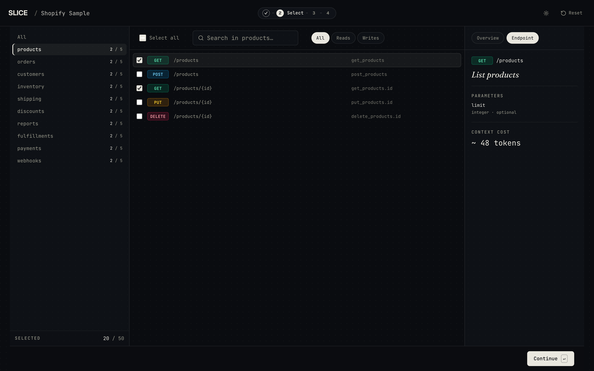
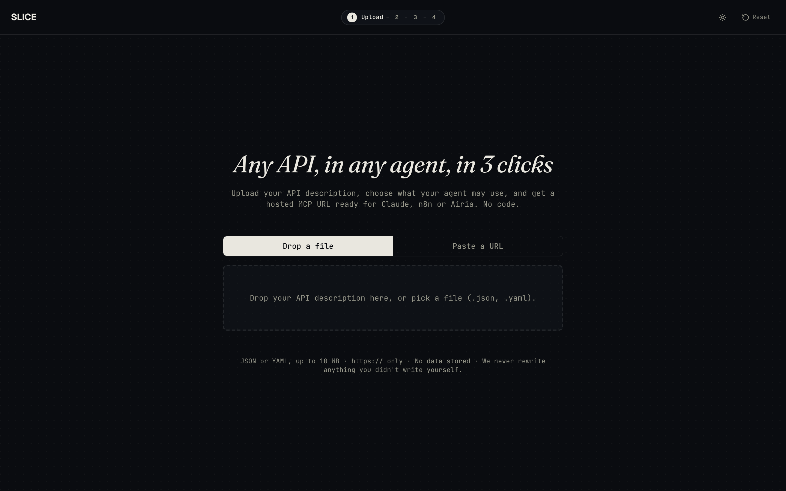
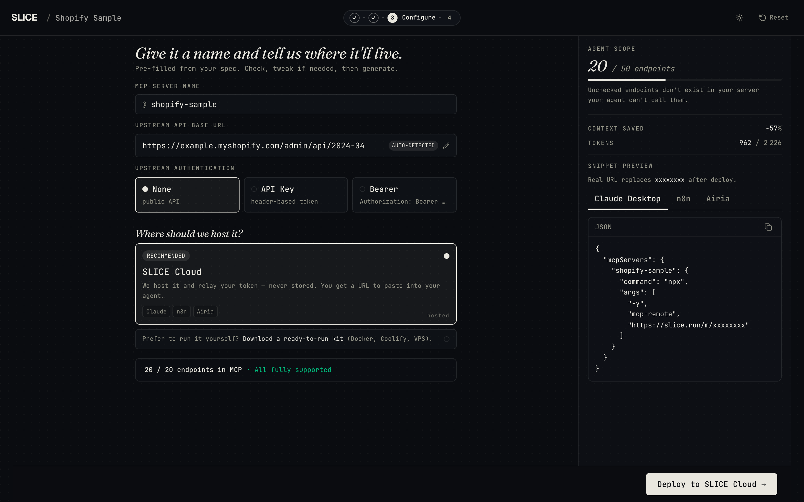
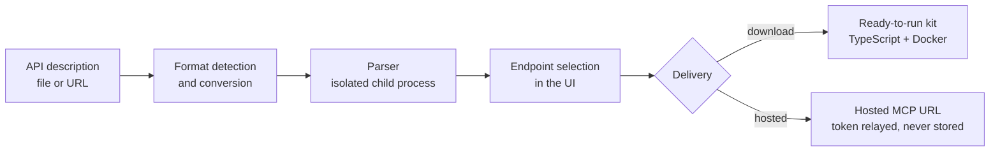

# SLICE

**Turn any API description into an MCP server that exposes only the endpoints your AI agent is allowed to call.**

[](https://www.repostatus.org/#wip)
[](https://github.com/cedricgicquiaud/slice/actions/workflows/ci.yml)
[](LICENSE.md)
[Case study](https://cedricgicquiaud.github.io/projets/slice/)



## Overview

AI agents (Claude, Cursor, n8n…) reach external APIs through MCP connectors. Exposing a whole API to an agent
grants it too much power and floods its context: an agent that only reads orders has no reason to be able to
delete them. Existing generators target developers (CLI, config files).

SLICE is a web service: upload an API description, tick the endpoints the agent may call, and get a connector.
Anything left unticked does not exist for the agent.

| Upload | Configure |
|---|---|
|  |  |

## Features

- **Least privilege by construction** — the generated server exposes the selected endpoints only.
- **Three input formats**, detected automatically:

  | Format | Versions | Handling |
  |---|---|---|
  | OpenAPI | 3.0, 3.1 | Used as is |
  | Swagger | 2.0 | Converted to OpenAPI 3.0 |
  | Postman Collection | v2.x | Converted to OpenAPI 3.0 |

- **Two delivery modes** — download the generated TypeScript server, or use a hosted URL to paste into the agent.
- **Upstream authentication** — OAuth2 client credentials, bearer token, API key. In hosted mode the user's token
  is relayed, never stored.
- **Works with any MCP client** — stdio and Streamable HTTP transports.

## Getting started

Requires Node.js 22+ and pnpm 9+. No API key needed.

```bash
git clone https://github.com/cedricgicquiaud/slice.git
cd slice && pnpm install
pnpm dev        # http://localhost:5173
```

`pnpm test` runs the test suite; `pnpm build && pnpm start` runs the production build.

## Architecture


A single Express server serves the React UI and the API. Generated servers are rendered from Handlebars templates on
top of `@modelcontextprotocol/sdk`.



Key decisions:
- **Isolated parsing.** Some specs exhaust memory. Parsing runs in a child process with a timeout, a memory cap and
  a concurrency limit: a malicious spec returns a clean error and the server stays up.
- **Server-side re-parse.** The server never trusts the parsed spec sent back by the browser; it re-parses the raw
  spec and filters the selection against its own result.
- **Hosted mode over a desktop binary.** The first plan shipped an executable; unsigned binaries are blocked by
  macOS Gatekeeper. The hosted mode serves several agent sessions in parallel instead.
- **External data is JSON-encoded in generated code.** Rule adopted after a review found two code-injection paths
  (token URL, OAuth scopes), both fixed.

<details>
<summary><strong>Project structure</strong></summary>

```
src/
├── client/            React UI
│   ├── screens/       Upload, Select, Configure, Done
│   └── components/    UI components; ui/ holds shadcn/ui primitives
├── server/            Express API and hosted MCP runtime
│   ├── routes/        upload, generate, host, hosted MCP endpoint
│   ├── services/      parsing, format conversion, SSRF guard, generation
│   └── templates/     Handlebars templates of the generated server
└── shared/            Types and Zod schemas shared by client and server
scripts/               Real-world corpus check, token calibration, production smoke test
docs/                  Reference documentation
```

</details>

## Documentation

| Document | Content |
|---|---|
| [API reference](docs/API.md) | Every route, request and response shapes, error codes, limits |
| [Configuration](docs/configuration.md) | Environment variables, production run, self-hosting the generated kit |
| [Generated server](docs/mcp-template.md) | How a selection becomes an MCP server: templates, tool naming, input schemas |
| [Token estimator](docs/token-estimator.md) | How the context cost is computed and calibrated |

## Status

Functional, not yet deployed.

- 556 automated tests, strict typing, CI on every pull request.
- 500 real public API descriptions run through the pipeline: 412 converted, 83 rejected cleanly, 5 too large,
  0 crashes (`corpus` workflow, on demand).
- Verified end to end in Claude Desktop against the Notion API.

Next: public hosted instance.


## License

[Functional Source License 1.1, MIT Future License](LICENSE.md): free to read, use internally, modify and
redistribute for any purpose other than a competing commercial product or service. Each version becomes MIT two
years after its release.
